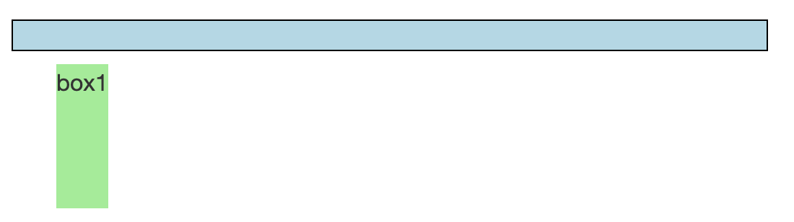
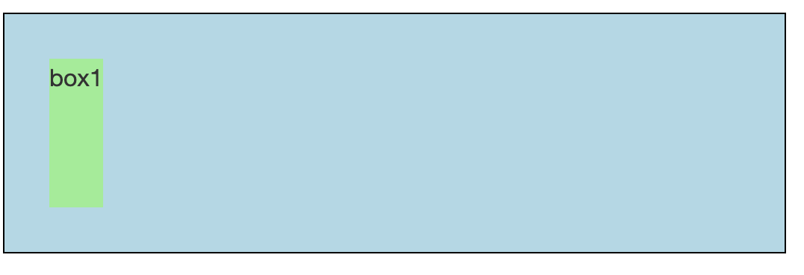
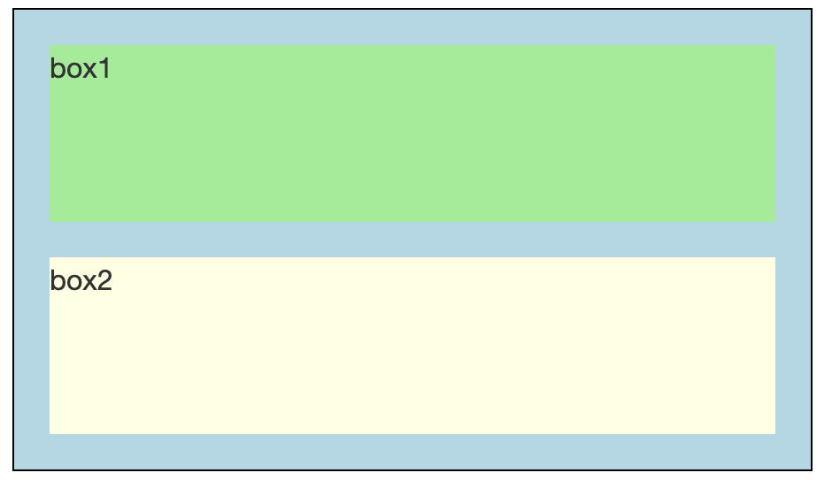
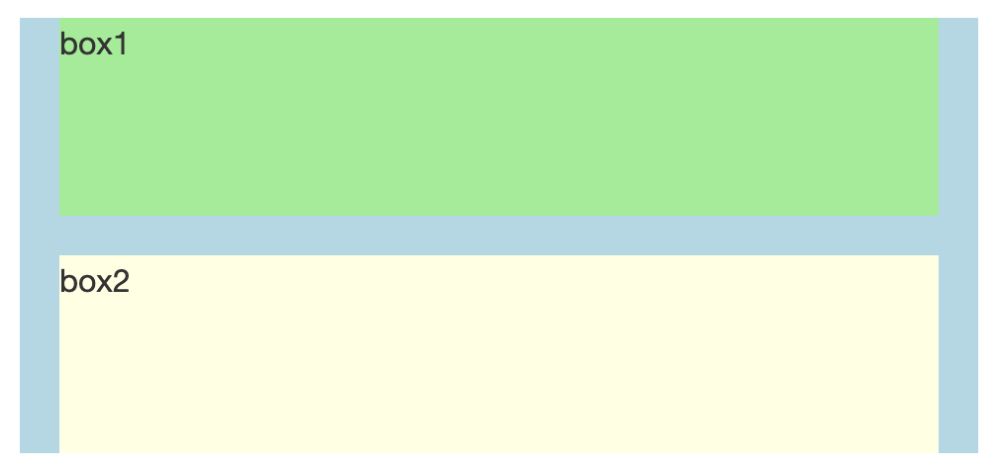
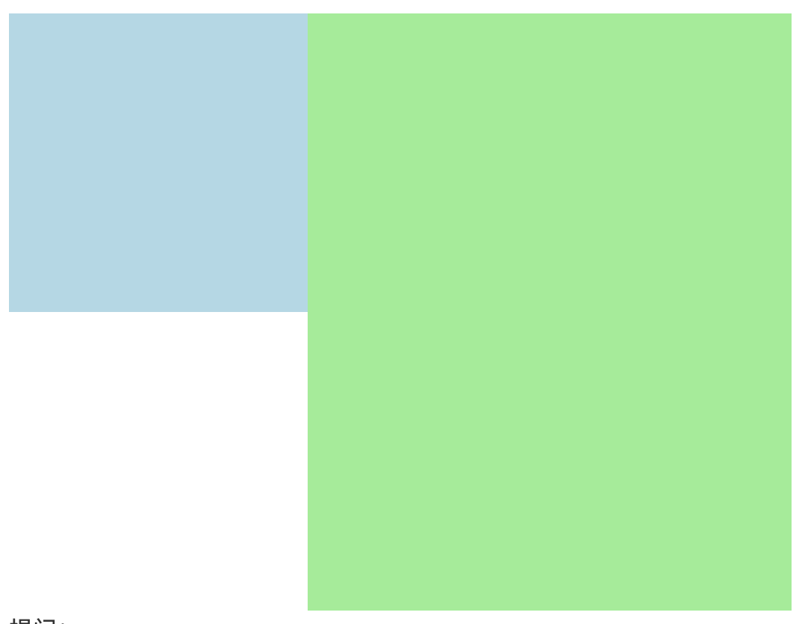

# BFC是什么

## 一、BFC介绍

BFC（Block Formatting Context）直译为"块级格式化上下文"，它是一个独立的渲染区域，只有Block-level box参与，它规定了内部的Block-level Box如何布局，并且与这个区域外部毫不相干。

## 二、BFC的创建

满足以下条件之一就可以创建BFC：

- 文档的根元素（<html>）。

- 浮动元素（即 float 值为 left, right 的元素）。

- 绝对定位元素（position 值为 absolute 或 fixed 的元素）。

- overflow 值为 <span style="color: red">auto, hidden, overlay, scroll 的块元素</span>

- 行内块元素（display 值为 inline-block 的元素）。

- 表格单元格（display 值为 table-cell，HTML 表格单元格默认值）。

- 表格标题（display 值为 table-caption，HTML 表格标题默认值）。

- 匿名表格单元格元素（display 值为 table（HTML 表格默认值）、table-row（表格行默认值）、table-row-group（表格体默认值）、table-header-group（表格头部默认值）、table-footer-group（表格尾部默认值）或 inline-table）。

- display 值为 flow-root 的元素。

- 弹性元素（display 值为 flex 或 inline-flex 元素的直接子元素），如果它们本身既不是弹性、网格也不是表格容器。

- 网格元素（display 值为 grid 或 inline-grid 元素的直接子元素），如果它们本身既不是弹性、网格也不是表格容器。

- contain 值为 layout、content 或 paint 的元素。

- 多列容器（column-count 或 column-width (en-US) 值不为 auto，且含有 column-count: 1 的元素）。

- column-span 值为 all 的元素始终会创建一个新的格式化上下文，即使该元素没有包裹在一个多列容器中（规范变更、Chrome bug）

## 三、BFC的特性

1. 内部的Box会在垂直方向，一个接一个地放置。

2. Box垂直方向的距离由margin决定。属于同一个BFC的父元素和子元素，相邻的父子或者兄弟间margin垂直方向会重叠，若2个元素属于不同的BFC，则垂直方向不会重叠

3. 所有子元素（包含浮动元素）与容器（父元素）左边对齐

4. BFC就是页面上的一个隔离的独立容器，容器里面的子元素不会影响到外面的元素。

5. 计算BFC的高度时，浮动元素也参与计算

6. BFC的区域不会与浮动元素box重叠。

## 四、BFC的应用

### 4.1 清除浮动（高度坍塌）

父级元素创建BFC，可以包含浮动的子元素，从而实现清除浮动。

``` html
<!DOCTYPE html>
<html>
<head>
  <style>
    .container{
      padding: 10px;
      border: 1px solid #000;
      background: lightblue; 
      overflow: hidden;
    }
    .box1{
      height: 100px;
      float: left;
      margin: 20px;
      background-color: lightgreen;
    }
  </style>
</head>
<body>
  <div class="container">
    <div class="box1">box1</div>
  </div>
</body>
</html>
```

图1: 
图2: 

以上代码块 container, box1都处于同一个bfc（html）

问：有什么方式可以让图一变成我们想要的图二样式？

答：container变成bfc: 设置overflow, display, float...

### 4.2 防止垂直margin重叠

#### 4.2.1 margin重叠的计算方式

全部都为正值，取最大值；

一正一负，求和；

全部都为负值，取最小值；

#### 4.2.2 什么情况会出现margin重叠

1. 同一BFC中，相邻的两个元素之间的垂直外边距重叠

    ``` html
    <!DOCTYPE html>
    <html>
    <head>
      <style>
        .container{
          border: 1px solid #000;
          background: lightblue; 
        }
        .box1{
          height: 100px;
          margin: 20px;
          background-color: lightgreen;
        }
        .box2{
          height: 100px;
          margin: 20px;
          background-color: lightyellow;
        }
      </style>
    </head>
    <body>
      <div class="container">
        <div class="box1">box1</div>
        <div class="box2">box2</div>
      </div>
    </body>
    </html>
    ```

    

2. 同一BFC中，空的块级元素上下相邻的两个box。（效果同上图）

    ``` html
    <div class="box1">box1</div>
    <div></div>
    <div class="box2">box2</div>
    ```

    提问：

    1. box1 margin-bottom: 50px;  box2 margin-top: 20px; box1和box2中间距离多少？

    2. box1 margin-bottom: 50px;  box2 margin-top: -20px; box1和box2中间距离多少？

    3. box1 margin-bottom: -50px;  box2 margin-top: -20px; box1和box2中间距离多少？

3. 同一BFC中，没有内容(padding, border,  text, ......)将父元素和元素分开

    ``` html
    <style>
        .container{
          margin: 20px;
          background: lightblue; 
        }
        .box1{
          height: 100px;
          margin: 20px;
          background-color: lightgreen;
        }
        .box2{
          height: 100px;
          margin: 20px;
          background-color: lightyellow;
        }
      </style>
    <div class="container">
        <div class="box1">box1</div>
        <div class="box2">box2</div>
      </div>
    ```

    

### 4.3 自适应两栏布局

左侧固定宽度，右侧自适应。左侧元素浮动，右侧元素创建BFC。

``` html
<style>
    .left {
      float: left;
      width: 200px;
      height: 200px;
      background-color: lightblue;
    }

    .right {
      overflow: auto;
      height: 400px;
      background-color: lightgreen;
    }
  </style>
<body>
  <div class="left"></div>
  <div class="right"></div>
</body>
```



提问：

> - 如果右侧box不创建bfc，页面渲染会是什么样？
> - 这使用的是bfc的哪个特性？

五、总结

BFC是CSS布局的重要概念，理解和掌握BFC有助于我们更好地进行页面布局，解决各种布局问题。希望通过这次分享，大家对BFC有了更深入的理解。
