# 「灵狐」升级改造分享之灵狐工程的三生三世

- [「灵狐」升级改造分享之灵狐工程的三生三世](#灵狐升级改造分享之灵狐工程的三生三世)
  - [第一世：低码引擎1.0](#第一世低码引擎10)
    - [产品面临的问题](#产品面临的问题)
    - [RD面临的问题](#rd面临的问题)
    - [V1.0的工程结构：manage + 榫卯 + steamer微前端](#v10的工程结构manage--榫卯--steamer微前端)
      - [仓库对应的产品页面](#仓库对应的产品页面)
      - [调试部署流程](#调试部署流程)
    - [V1.0工程痛点](#v10工程痛点)
  - [第二世：低码引擎2.0](#第二世低码引擎20)
    - [面临的问题](#面临的问题)
    - [做了什么？](#做了什么)
    - [解决了什么问题？](#解决了什么问题)
  - [第三世：灵狐时代](#第三世灵狐时代)
    - [面临的问题](#面临的问题-1)
    - [全面升级](#全面升级)
    - [灵狐3.0产物](#灵狐30产物)
  - [三个阶段部署对比](#三个阶段部署对比)
  - [各阶段的成果](#各阶段的成果)

灵狐产品到目前一共经历了3个阶段：

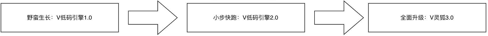

## 第一世：低码引擎1.0

在初创阶段，产品形态探索性发展，并且需要快速迭代。

### 产品面临的问题

1. MVP版需要快速启动；
2. 产品形态未知；

### RD面临的问题

1. 阿里低码有一些理解&学习成本；
2. 缺乏同类产品开发经验；

### V1.0的工程结构：manage + 榫卯 + steamer微前端

需要维护4个仓库。在3个平台部署发布。

#### 仓库对应的产品页面

| 运行时                   | 设计时                 |
| ------------------------ | ---------------------- |
| 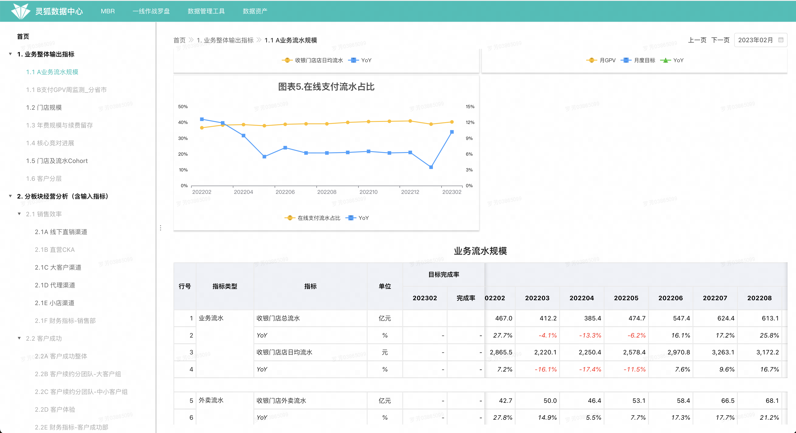 | 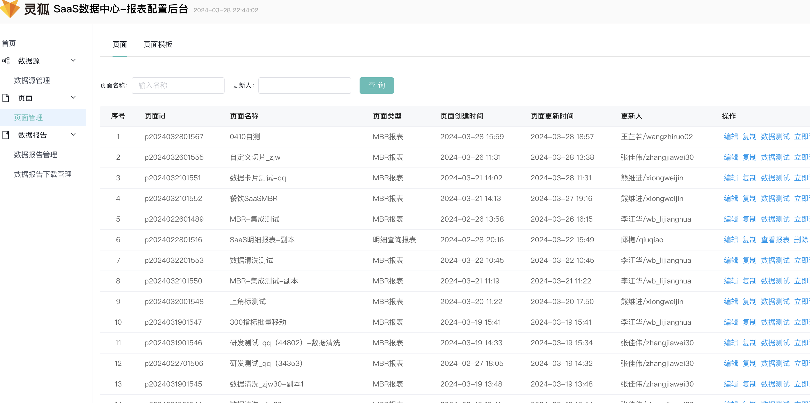 |
| -                        | 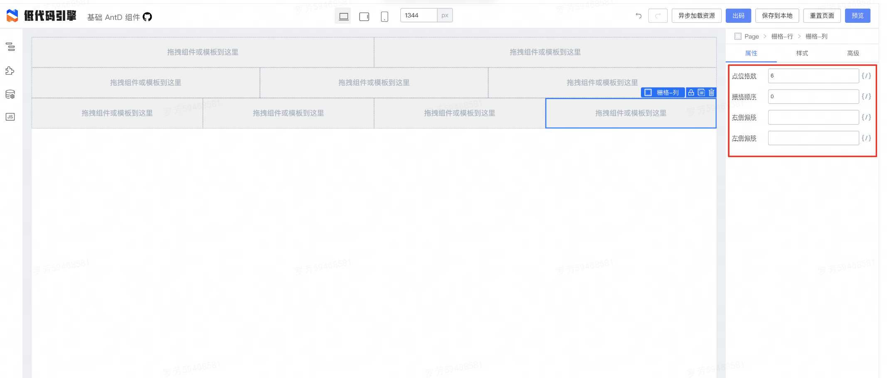 |

#### 调试部署流程

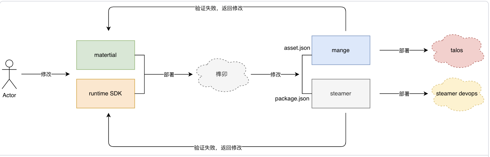

### V1.0工程痛点

研发：调试困难，验证链路长，开发效率低

产品：迭代后更新版本开销大（或研发洗数），性能体验差

## 第二世：低码引擎2.0

产品继续需要敏捷迭代，交付商分使用

### 面临的问题

存在第一阶段的工程痛点，同时产品还需要继续敏捷迭代。

### 做了什么？

为了解决V1.0的工程痛点，这个阶段采取了以下措施：

1. 【工程】去掉了物料npm包，物料迁移到manage项目。
2. 【技术】重构了重要业务块的技术方案。
3. 【技术】沉淀了一些基础原子组件。

### 解决了什么问题？

1. 重点提升了RD开发设计时调试体验，节约了至少一半的调试时间。
2. 开发体验提升为后续快速迭代打下了基础。
3. 技术方案重构，有效减少bug率。

## 第三世：灵狐时代

### 面临的问题

1. 工程不统一，性能提升有效
2. 工程架构（微前端）与灵狐产品目前定位不太匹配；
3. 目前的工程架构使后续的需求实现难度较大；
4. 不增加配置用户理解研发概念的前提下，布局能力（流式布局）有限；

### 全面升级

灵狐产品参考monorepo的代码管理策略，升级为manage大一统的灵狐工程，实现代码复用且业务分离。

根据产品的领域大致可分为：

1. 管理后台 - main
2. 看数运行时 - linghu
3. 配置设计时 - linghuEdit
4. 外网入口 - distribute

| monorepo                         | 灵狐                       |
| -------------------------------- | -------------------------- |
| 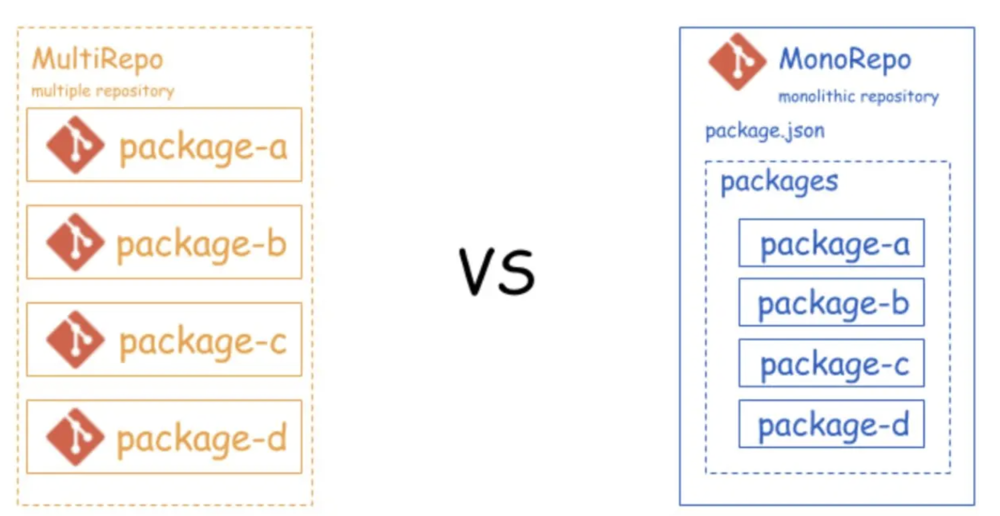 | 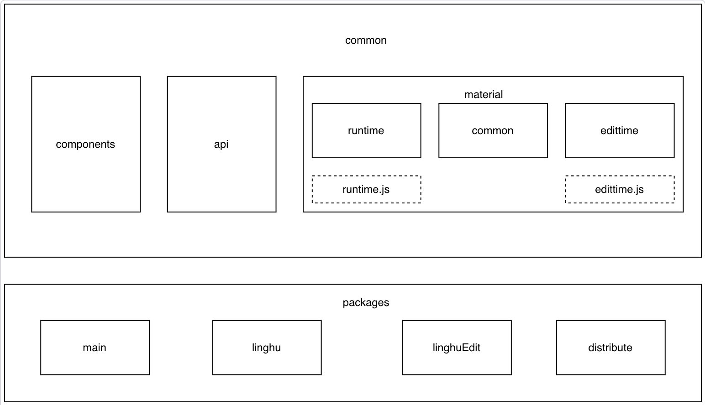 |

### 灵狐3.0产物

业务代码运行时&设计时分离。打包构建时，分别打包各自场景需要的资源。

|              | 设计时                     | 运行时                      |
| ------------ | -------------------------- | --------------------------- |
| 主要模块大小 | 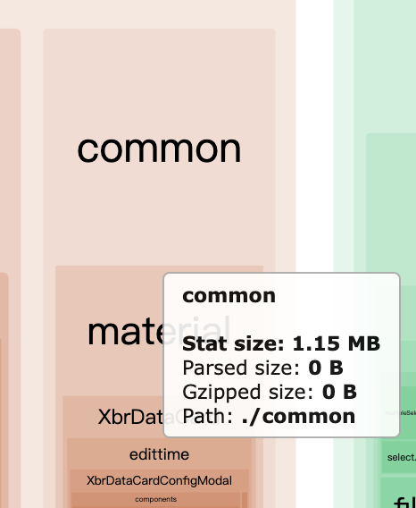 | 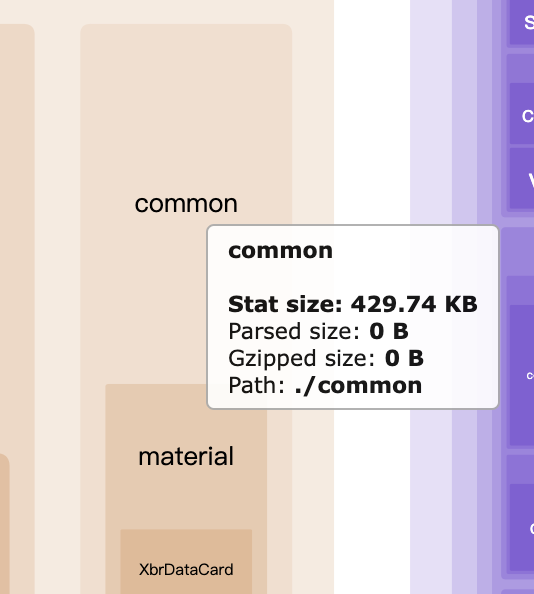 |
| 物料打包模块 | 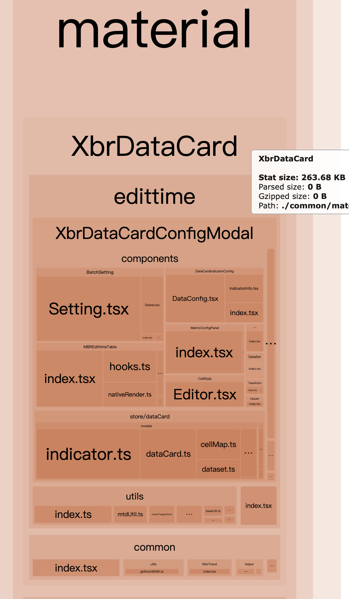 | 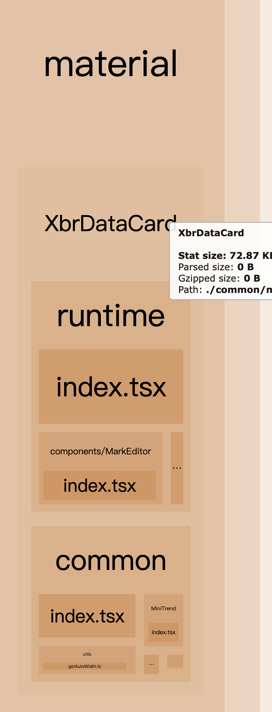 |

最终产物
 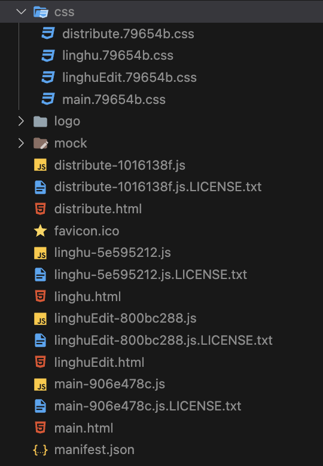
 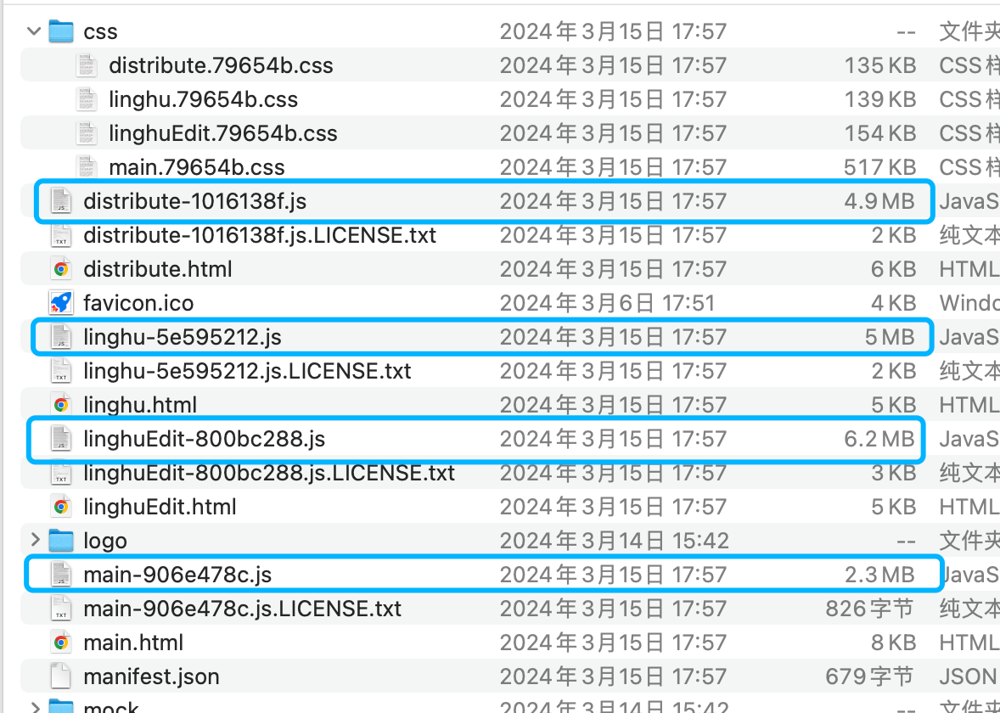

## 三个阶段部署对比

 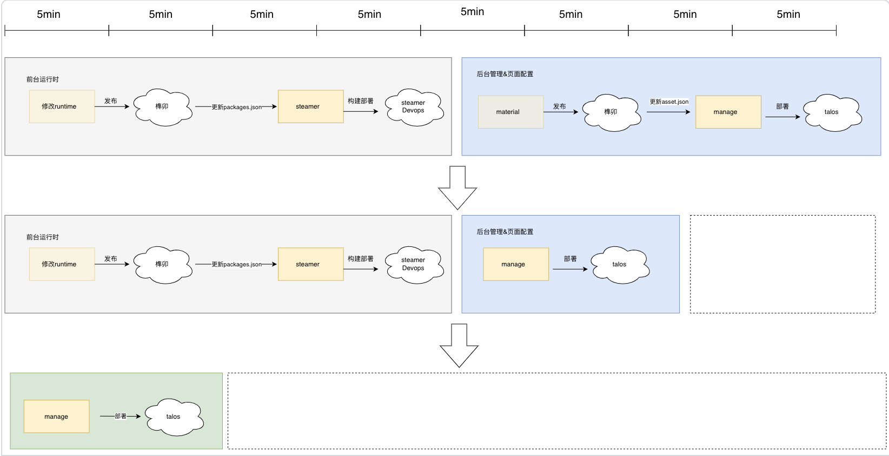

## 各阶段的成果

| **V1.0** | **V2.0**                        | **V3.0**                                                                                        |
| -------------- | ------------------------------------- | ----------------------------------------------------------------------------------------------------- |
| 产出灵狐MVP版  | 去掉物料npm包 提升研发体验和效率 | 优化部署流程和验证debug链路 无需发版就洗数，降低各迭代的评估成本 性能升级 统一灵狐工程 |
