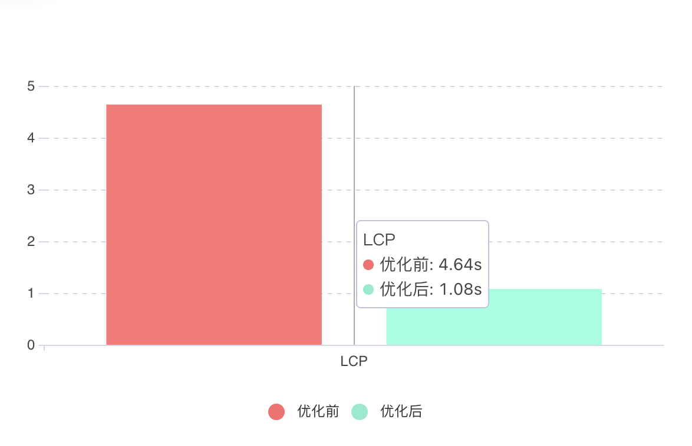

# 性能优化应用实践

## 优化思路

工程统一，去掉微前端和低码，只留下一个运行时，只需要拉取一次数据，从服务端拉取数据直接渲染

| 优化前                                                                                     | 优化后                                        |
| :----------------------------------------------------------------------------------------- | :-------------------------------------------- |
|  黄色：微前端 蓝色：低码引擎 绿色：数据单页 | ] 数据单页 |

## 优化结果

### 瀑布资源图

总体拉取资源更少，只需要一次就可以拉取所有资源，无需多次拉取资源，减少重排次数

| 优化前                                     | 优化后                                   |
| :----------------------------------------- | :--------------------------------------- |
|  |  |

### 加载资源数

总共加载6个资源,   总体资源大小约6.2MB，优化后资源数减少了约68.42%，资源大小减少了0.9MB

| 优化前                                  | 优化后                                |
| :-------------------------------------- | :------------------------------------ |
|  |  |

### LCP 对比

优化后页面渲染速度提升约76%

