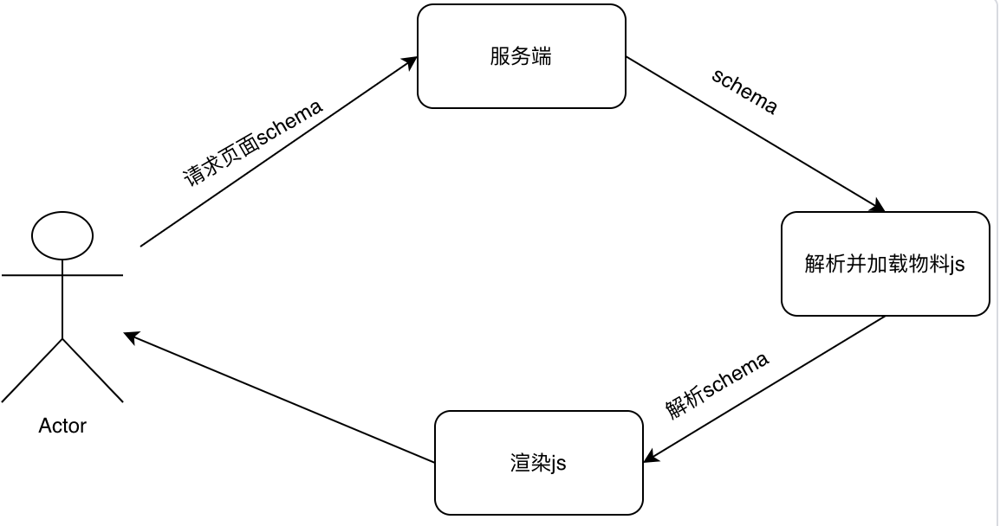

# 性能优化应用实践-灵狐

项目前台现存在三个运行时，从整体上主要分两个部分微前端、低代码；下面分别会从这两个部分进行分析。

## 微前端

### 渲染流程

### 加载资源

总共19个资源， 总体资源大小为**7.1MB**

### 代码使用率

* **网址**列是所分析资源的网址。
* **Type** 列显示资源是否包含 CSS 和/或 JavaScript。
* **Total Bytes** 列是资源的总大小（以字节为单位）。
* **Unused Bytes** 列是未使用的字节数。
* 最后一个未命名的列是 **Total Bytes** 列和 **Unused Bytes** 列的可视化图表。竖条的红色部分是未使用的字节。绿色部分使用字节。

**通过上面分析可知，微前端在render服务返回HTML**以及**动态加载子模块JS时拉取依赖资源较多，并且存在部分资源首屏时使用率4%，优化方向可从减少资源拉取次数以及资源数。**

## 低代码

从流程图可以看到，渲染时需要拉取 **额外的物料资源，最后渲染时还需要解析scheam** ，不能直接通过服务端的数据进行渲染。

## 优化思路

工程统一，去掉微前端和低码，只留下一个运行时，只需要拉取一次数据，从服务端拉取数据直接渲染

| 优化前                                                                                     | 优化后                                        |
| :----------------------------------------------------------------------------------------- | :-------------------------------------------- |
|  黄色：微前端 蓝色：低码引擎 绿色：数据单页 | ] 数据单页 |

## 优化结果

### 瀑布资源图

总体拉取资源更少，只需要一次就可以拉取所有资源，无需多次拉取资源，减少重排次数

| 优化前                                     | 优化后                                   |
| :----------------------------------------- | :--------------------------------------- |
|  |  |

### 加载资源数

总共加载6个资源,   总体资源大小约6.2MB，优化后资源数减少了约68.42%，资源大小减少了0.9MB

| 优化前                                  | 优化后                                |
| :-------------------------------------- | :------------------------------------ |
|  |  |

### LCP 对比

优化后页面渲染速度提升约76%

